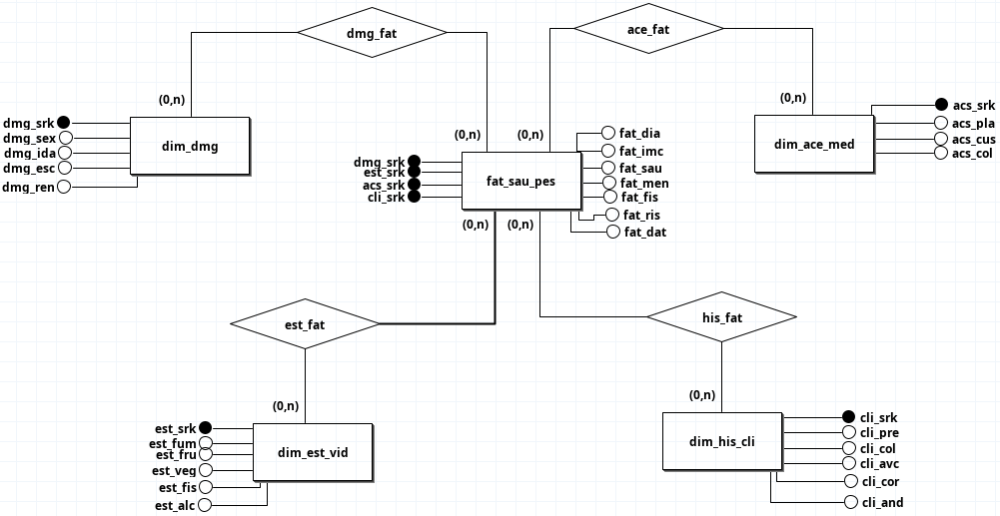
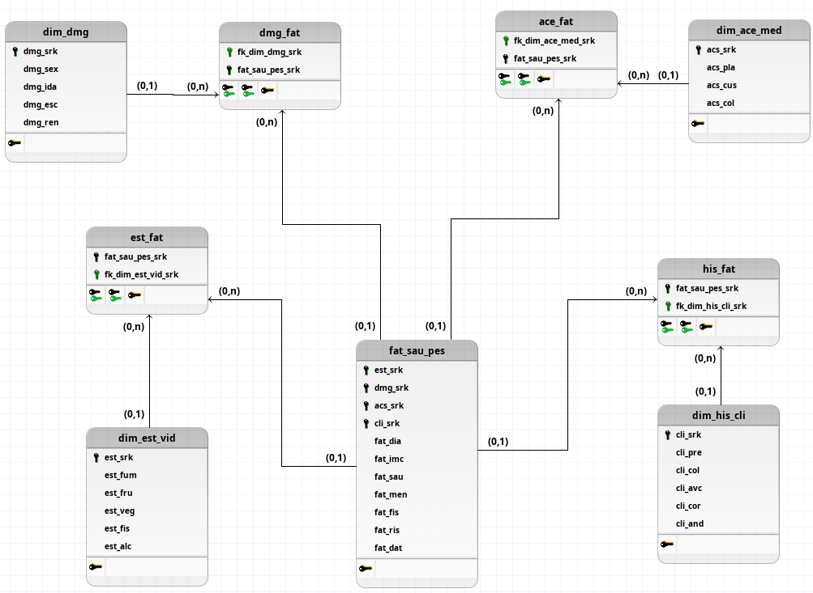

# 1. ME-R (Modelo Entidade-Relacionamento)

fat_saude_pessoa (<u>fat_id</u>, dmg_srk, est_srk, acs_srk, cli_srk, fat_dia, fat_imc, fat_sau, fat_men, fat_fis, fat_ris, fat_dat )  
dim_dmg (<u>dmg_srk</u>, dmg_sex, dmg_ida, dmg_esc, dmg_ren) 
dim_est_vid (<u>est_srk</u>, est_fum, est_fru, est_veg, est_fis, est_alc) 
dim_acesso_medico (<u>acs_srk</u>,acs_pla, acs_cus, acs_col) 
dim_historico_clinico (<u>cli_srk</u>, cli_pre, cli_col, cli_avc, cli_cor, cli_and) 

# DE-R

# DLD

