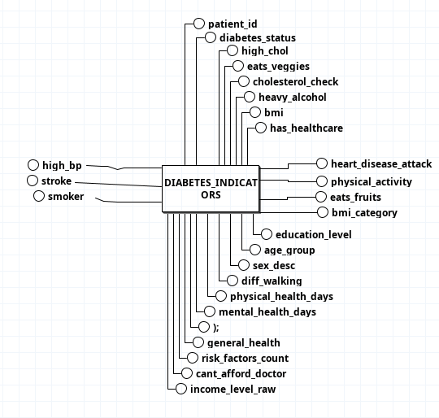
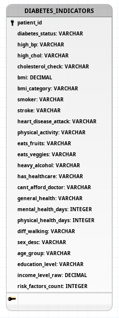

# 1. ME-R (Modelo Entidade-Relacionamento)

DIABETES_INDICATORS (<u>patient_id</u>, diabetes_status, high_bp, high_chol, cholesterol_check, bmi, bmi_category, smoker, stroke, heart_disease_attack, physical_activity, eats_fruits, eats_veggies, heavy_alcohol, has_healthcare, cant_afford_doctor, general_health, mental_health_days, physical_health_days, diff_walking, sex_desc, age_group, education_level, income_level_raw, risk_factors_count)

# DE-R

# DLD

