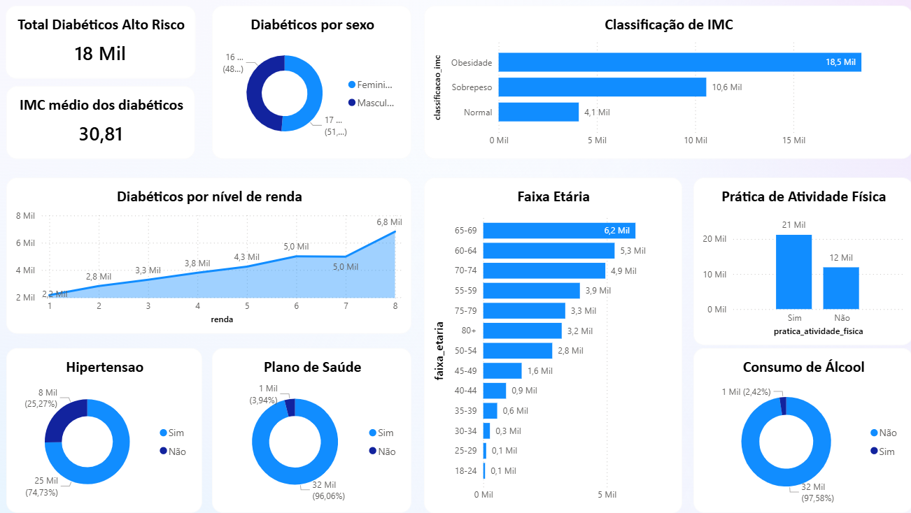

# Diabetes Health Indicators Dataset

ETL pipeline with Medallion Architecture for Diabetes Health Indicators data analysis.

### Authors

- Taynara Cristina Ribeiro Marcellos ([Taynara Cristina](https://github.com/TaynaraCris))
- Luis Henrique Luz Costa ([luishenrrique](https://github.com/luishenrrique))

### Dataset

[Diabetes Health Indicators Dataset (253k items) - 2015](https://www.kaggle.com/datasets/alexteboul/diabetes-health-indicators-dataset)

### Dashboard



## Requirements

* **Docker** and **Docker Compose**
* **Python 3.11+**

## How to run

### 1. Start the database

```bash
docker compose up -d
```

### 2. Install dependencies

python -m venv .venv

# Windows:
.\.venv\Scripts\activate
#### Linux/Mac:
#### source .venv/bin/activate

pip install -r requirements.txt

### 3. Run notebooks in order

1. Data Layer/Transformer/etl_raw_to_silver.ipynb

- Loads raw data into silver.diabetes_indicators table.

2. Data Layer/Transformer/etl_silver_to_gold.ipynb

- Creates the Star Schema in the dw (Gold) layer.

3. Data Layer/Analytics/analytics.ipynb

- Business analysis and insights.
